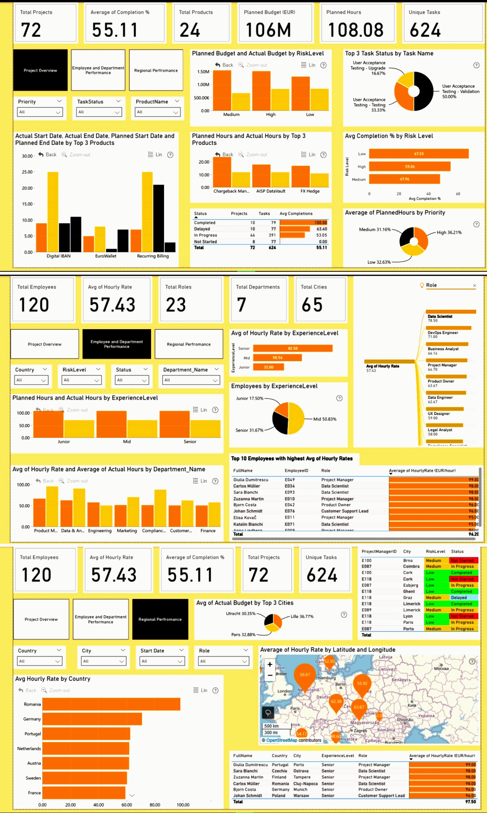
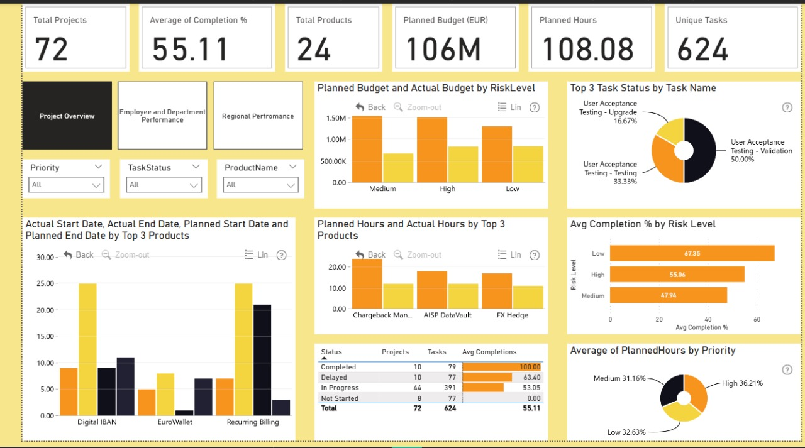
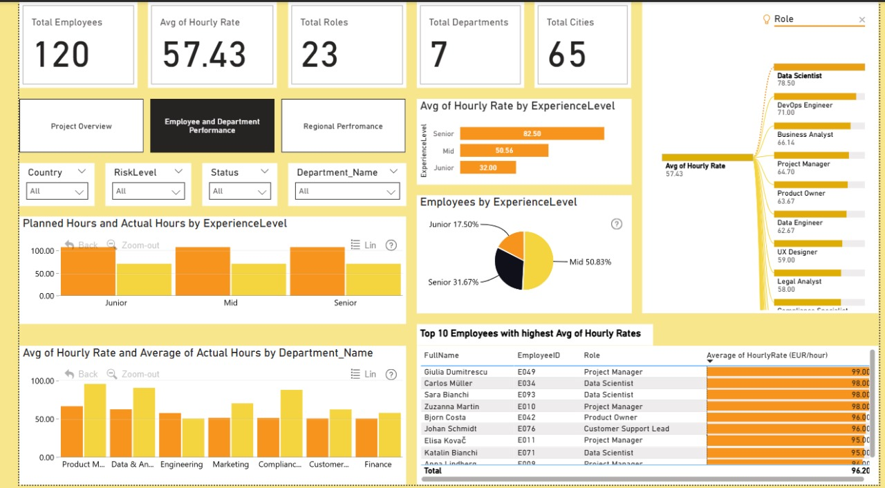
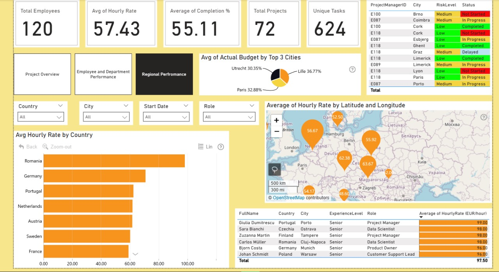

# FP20 Fintech Project Management Report

## 📊 Challenge Overview  
This repository contains my submission for the **FP20Analytics Fintech Project Management Challenge**, built using **Power BI** and enhanced with **ZoomCharts** for interactive visuals. The dashboard explores project performance, employee metrics, and regional budget allocation across a simulated FinTech environment for the **Onyx Data November 2025 Challenge 32**.

### Combined View of All Pages  

---

## Dashboard Narrative  
The report is structured across four pages, each designed to surface insights through dynamic visuals and layered storytelling.

### Key Insights:
- **72 Projects** tracked with an average completion rate of **55.11%**
- **Planned Budget:** €106M across 24 products
- **Task Breakdown:** User Acceptance Testing dominated across validation, upgrade, and training phases
- **Top Products:** Digital IBAN, EuroWallet, Recurring Billing
- **Employee Metrics:** 120 employees across 65 cities, with hourly rates peaking at €98
- **Experience Levels:** Mid-level employees formed 50.83% of the workforce
- **Departmental Trends:** Product Management and Data & Analytics led in planned hours
- **Geographic Spend:** Utrecht, Lille, and Paris topped actual budget allocation
- **Mapped Hourly Rates:** Visualized across Europe using latitude-longitude overlays

---

## 📄 Report Structure & Visuals

### Page 1 – KPI Summary and Risk-Level Budget Breakdown  

### Page 2 – Task Status, Product Timelines, and Priority Analysis  

### Page 3 – Employee Distribution, Experience-Level Metrics, and Departmental Trends  

---

## 🔗 GitHub Repository  
This repository includes:
- All dashboard visuals  
- This README.md file  
- Future updates will include the `.pbix` file and walkthrough notes

---

## 🙏 Acknowledgments  
Thanks to **FP20 Analytics** and **ZoomCharts** for organizing this challenge and enabling rich, interactive storytelling through data.

---

## 📌 Author  
**Gyanankur Baruah**  
Connect with me on [LinkedIn](https://www.linkedin.com/in/gyanankurbaruah)